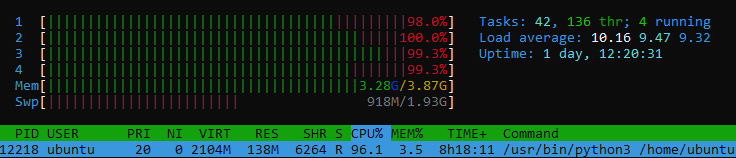

Jetson Nano Docker with Gstreamer v2
====================================

Refering to [v1](https://github.com/VeCAD/jetson-gstreamer-docker), after fiddling around trying to 
restart the nvargus-daemon inside the container, I felt this wasn't really a clean solution, so I decided 
to look around for other options of running the nvargus-daemon isolated from the host system.

I came across this repo https://github.com/zrzka/nanny-bot that copies and installs the necessary L4T files 
into the container, installs them and runs the container without the `nvidia-runtime` needed to share CUDA 
ecosystem of the host. 

Following the guide in the Readme, I managed to get the following files installed in the container using
Jetpack 4.4.1 (L4T 32.4.4). In my case, this was the L4T files required as I was using a later version 32.4.4.

```
nvidia/
├── deb
│   ├── cuda-repo-l4t-10-2-local-10.2.89_1.0-1_arm64.deb
│   ├── graphsurgeon-tf_7.1.3-1+cuda10.2_arm64.deb
│   ├── libcudnn8_8.0.0.180-1+cuda10.2_arm64.deb
│   ├── libcudnn8-dev_8.0.0.180-1+cuda10.2_arm64.deb
│   ├── libcudnn8-doc_8.0.0.180-1+cuda10.2_arm64.deb
│   ├── libnvinfer7_7.1.3-1+cuda10.2_arm64.deb
│   ├── libnvinfer-bin_7.1.3-1+cuda10.2_arm64.deb
│   ├── libnvinfer-dev_7.1.3-1+cuda10.2_arm64.deb
│   ├── libnvinfer-doc_7.1.3-1+cuda10.2_all.deb
│   ├── libnvinfer-plugin7_7.1.3-1+cuda10.2_arm64.deb
│   ├── libnvinfer-plugin-dev_7.1.3-1+cuda10.2_arm64.deb
│   ├── libnvinfer-samples_7.1.3-1+cuda10.2_all.deb
│   ├── libnvonnxparsers7_7.1.3-1+cuda10.2_arm64.deb
│   ├── libnvonnxparsers-dev_7.1.3-1+cuda10.2_arm64.deb
│   ├── libnvparsers7_7.1.3-1+cuda10.2_arm64.deb
│   ├── libnvparsers-dev_7.1.3-1+cuda10.2_arm64.deb
│   ├── libvisionworks-repo_1.6.0.501_arm64.deb
│   ├── libvisionworks-sfm-repo_0.90.4.501_arm64.deb
│   ├── libvisionworks-tracking-repo_0.88.2.501_arm64.deb
│   ├── OpenCV-4.1.1-2-gd5a58aa75-aarch64-dev.deb
│   ├── OpenCV-4.1.1-2-gd5a58aa75-aarch64-libs.deb
│   ├── OpenCV-4.1.1-2-gd5a58aa75-aarch64-licenses.deb
│   ├── OpenCV-4.1.1-2-gd5a58aa75-aarch64-python.deb
│   ├── OpenCV-4.1.1-2-gd5a58aa75-aarch64-samples.deb
│   ├── python3-libnvinfer_7.1.3-1+cuda10.2_arm64.deb
│   ├── python3-libnvinfer-dev_7.1.3-1+cuda10.2_arm64.deb
│   ├── tensorrt_7.1.3.0-1+cuda10.2_arm64.deb
│   ├── uff-converter-tf_7.1.3-1+cuda10.2_arm64.deb 
├── nvgstapps.tbz2
└── nvidia_drivers.tbz2
├── config.tbz2
```
Instead of using the original Dockerfile balena image, using here arm64v8/ubuntu:18.04 one.

The camera requires `nvargus-daemon &` to be started inside the container per the 
original repo container startup script. Moved it here to inside capture.py

To run this container
```
docker-compose build
docker-compose run nano bash
```

Run the capture.py
```
python3 capture.py
```

In case cv display fails, type this in host
```
xhost +local:docker
```
Camera stability test

Sending the camera feed to a Darknet Yolo inference engine. 640x480 image size, 
had to drop the framerate to 15, otherwise results in buffer overflow issues
```
 def gstreamer_pipeline(self,
        capture_width=640,
        capture_height=480,
        display_width=640,
        display_height=480,
        framerate=15,
        flip_method=0
        ):
        return (
        "nvarguscamerasrc ! "
        "video/x-raw(memory:NVMM), "
        "width=(int)%d, height=(int)%d, "
        "format=(string)NV12, framerate=(fraction)%d/1 ! "
        "nvvidconv flip-method=%d ! "
        "video/x-raw, width=(int)%d, height=(int)%d, format=(string)BGRx ! "
        "videoconvert ! "
        "video/x-raw, format=(string)BGR ! appsink drop=True "
        % (
            capture_width,
            capture_height,
            framerate,
            flip_method,
            display_width,
            display_height
        )
        )
```

Tegrastats
```
RAM 2927/3963MB (lfb 14x4MB) SWAP 1006/1981MB (cached 36MB) CPU [92%@1479,96%@1479,95%@1479,96%@1479] EMC_FREQ 0% 
GR3D_FREQ 99% PLL@54.5C CPU@59.5C iwlwifi@57C PMIC@100C GPU@56.5C AO@61.5C thermal@58.5C POM_5V_IN 8055/7870 
POM_5V_GPU 2424/2206 POM_5V_CPU 3084/3110
```

Htop
>8 hrs without camera disconnecting or nvargus crashing


Notes on up host distro upgrade \
I noticed that stability got worse after upgrading the host distro. 
Suspect either the Docker or L4T package updates is breaking something. 
```
sudo apt update
sudo apt upgrade -y
```
Had to reflash to original L4T image to regain the stability

